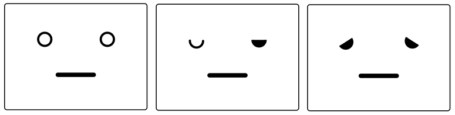

# node-red-contrib-mcu-draw-face

A simple node for drawing a face on an MCU screen.

## Table of Contents
1. [About](#about)
2. [What is Node-RED MCU?](#what-is-node-red-mcu)
3. [What is Stack-chan?](#what-is-stack-chan)
4. [Installation](#installation)
5. [Usage](#usage)
6. [Commands to change expressions](#commands-to-change-expressions)
7. [Details of face properties](#details-of-face-properties)
8. [Examples](#examples)
9. [Contributing](#contributing)
10. [License](#license)

## About
This node is used to display a simple face like Stack-chan on the MCU device.
You can use this node with Node-RED MCU Edition.

## What is Node-RED MCU?
Node-RED MCU Edition is a Node-RED runtime that runs on resource-constrained microcontrollers (MCUs) released by Mr. Peter Hoddie.
Node-RED MCU product page is here: [https://github.com/phoddie/node-red-mcu](https://github.com/phoddie/node-red-mcu)

## What is Stack-chan?
Stack-chan is a super cute, palm-sized communication robot developed and released by Shishikawa-san.  
Stack-chan product page is here: [https://github.com/meganetaaan/stack-chan](https://github.com/meganetaaan/stack-chan)

## Installation
To install this node, run the following command in your Node-RED user directory (typically `~/.node-red`):
```bash
npm install git+https://github.com/mshioji/node-red-contrib-mcu-draw-face
```
Or, if it is already registered in npm, you can also install it with the following command:
```bash
npm install @mshioji/node-red-contrib-mcu-draw-face
```
Please restart Node-RED after installation.

## Usage
To change the face display specifications:

Edit the face object properties on the property window of this node to change the default face.
Or, obtain the face object output by sending a message to the node then change the properties like eye and mouth within the face object and input them into the node by storing them in `msg.payload`.
You can also send only the properties that need to be changed instead of the entire face object.
Please note face properties should be in `msg.payload.face`.<br>

### Commands to change expressions
You can change expressions by sending the face object each time, but some expressions have dedicated commands.<br>
Send the following strings in `msg.payload.cmd` to change the expression:<br>
Please note the `command` property should be in `msg.payload.cmd`.<br>

- `"blink"`: Blinks the eyes
- `"wink"`: Winks
- `"smile"`: Smiles
- `"frown"`: Frowns
- `"talk"`: Randomly updates the mouth shape to simulate talking
- `"talk_stop"`: Stops the "talk" action
- `"default"`: Resets the face display specifications to default

### Details of face properties
You can change the face by editing the face object JSON in the property window.<br>
Following specifications are common to the case that sending the face object of `msg.payload.face` to the input terminal.


#### Eye Properties
- `pupillary_distance`: Set the distance between the eyes.
- `vPos`: Vertical position from the top of the screen.

Each eye (`left` and `right`) has individual properties:
- `enable`: `true` or `false` to display or not display the item.
- `x`, `y`: Shift the position.
- `w`, `h`: Width and height.
- `rotation`: Rotation of the item, set in degrees.
- `arcStart`: Start position of the arc, set in degrees.
- `arcStop`: Stop position of the arc, set in degrees.
- `lineWidth`: Width of the line.
- `drawMode`: Set `"fill"` or `"stroke"`.



#### Mouth Properties
- `vPos`: Vertical position from the top of the screen.
- `enable`: `true` or `false` to display or not display the item.
- `shape`: `"line"` or `"oval"`.
- `x`, `y`: Shift the position.
- `w`, `h`: Width and height.
- `lineWidth`: Width of the line.
- `curveStrength`: Positive number for a smile, negative number for a disgruntled face.
- `rotation`: Rotation of the item, set in degrees.
- `arcStart`: Start position of the arc, set in degrees.
- `arcStop`: Stop position of the arc, set in degrees.
- `drawMode`: Set `"fill"` or `"stroke"`.


## Examples
There is an [example flow](./examples/flows_example-draw-face.json) to get you started.<br>
Please refer to the "examples" folder.

## Contributing
We welcome contributions! If you have any ideas, suggestions, or bug reports, please open an issue or submit a pull request on GitHub.

## License
This project is licensed under the Apache-2.0 License - see the [LICENSE](LICENSE) file for details.
